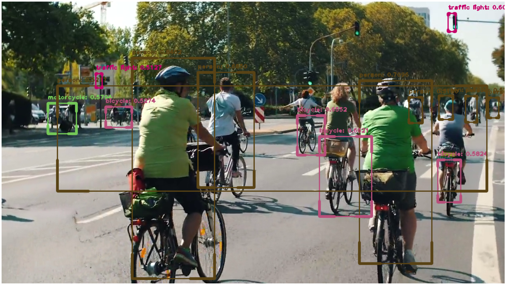

# Object-Detection-Using-OpenCV

 In this project project we are going to do real-time object detection laptop camera or webcam using OpenCV (we will test ii on mp4 video). The idea is to loop over each frame of the video stream, detect objects like person, chair, dog, etc. and bound each detection in a box. Here, we will go through the steps required for setting up the project and some explanation about the code.

# Project-Screen-shot

